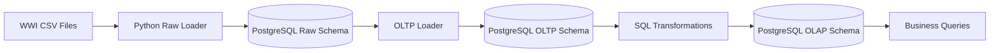
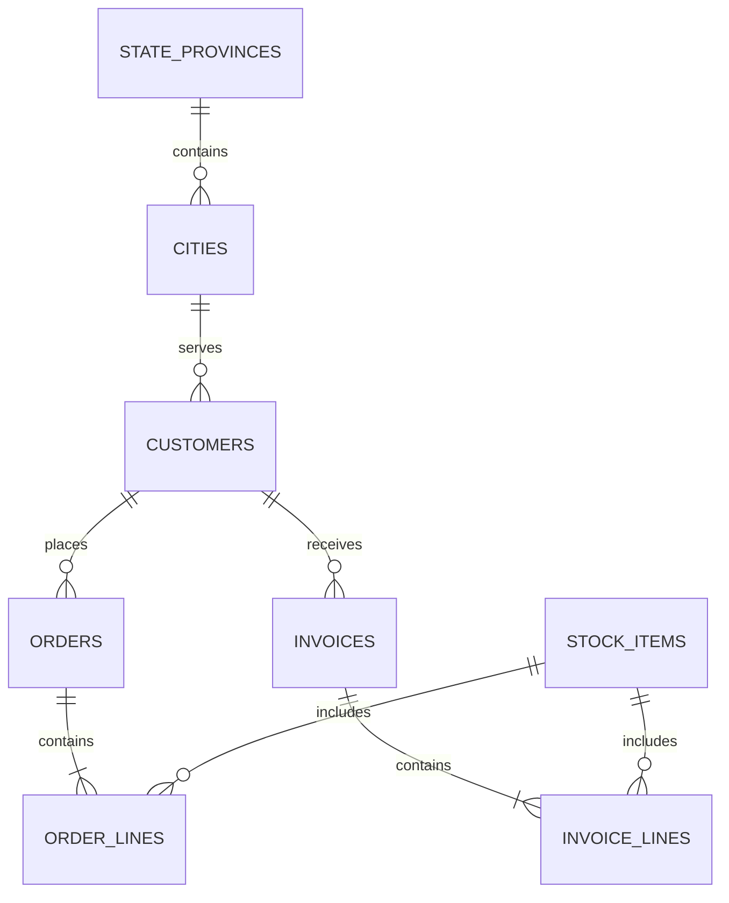
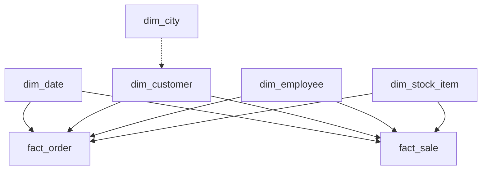

# Data Engineering Pipeline Architecture

## Pipeline

## OLTP Relationships

## OLAP Schema

## Fact Table Grain

- `fact_order`: one row per order line, identified by `order_line_id`.
- `fact_sale`: one row per invoice line, identified by `invoice_line_id`.

## Technology

- Database: PostgreSQL
- Ingestion: Python
- Transformations: SQL
- Orchestration: PowerShell
- Input format: semicolon-delimited CSV